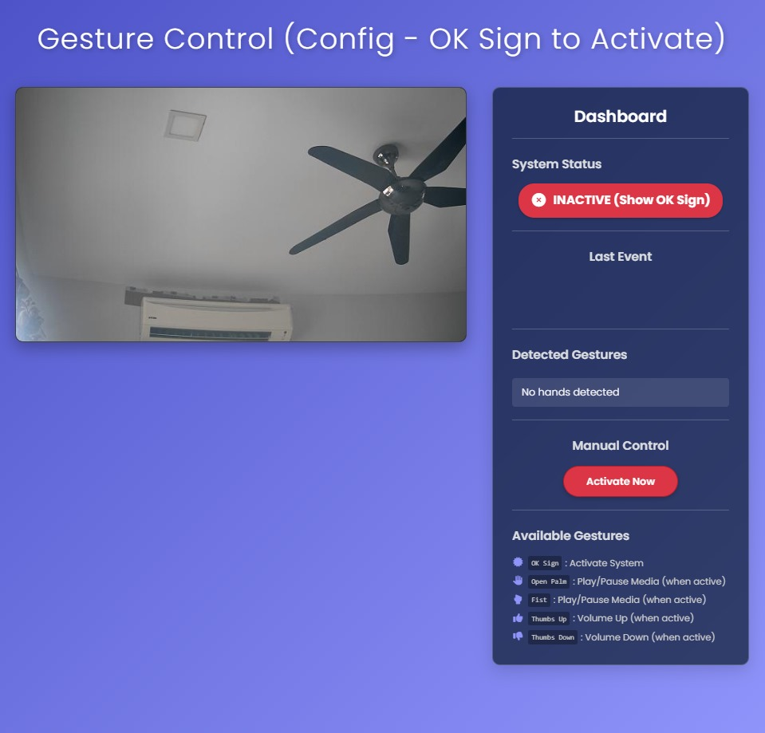

# ✨ Gesture Control Web Application ✨

[](https://opensource.org/licenses/MIT)
[](https://www.python.org/)
[](https://flask.palletsprojects.com/)
[](https://socket.io/)
[](https://developers.google.com/mediapipe)
[](CONTRIBUTING.md) 

**Control your computer's media playback using hand gestures through your webcam!** This project leverages the power of MediaPipe for real-time hand tracking and gesture recognition, wrapped in a user-friendly Flask web interface with real-time feedback via Socket.IO.

---

## 🌟 Key Features

* **💻 Web-Based Interface:** Access the controls from your browser. No complex desktop installation needed (beyond Python dependencies).
* **📹 Live Video Feed:** See yourself and the detected hand landmarks in real-time.
* **📊 Interactive Dashboard:** Monitor system status, view recognized gestures per hand, see the last action performed, and access manual controls.
* **👋 Real-time Gesture Recognition:** Utilizes Google's MediaPipe Hands for efficient and relatively robust hand tracking. Implemented gestures include:
    * `OK Sign`: Activate / Deactivate the control system.
    * `Open Palm`: Trigger Play/Pause media action.
    * `Fist`: Trigger Play/Pause media action.
    * `Thumbs Up` / `Thumbs Down`: Attempt volume control (See Limitations).
* **🖱️ System Control:** Uses `PyAutoGUI` to simulate media key presses (Play/Pause, Volume Up/Down).
* **🔊 Audio Feedback (Optional):** Provides sound cues for activation/deactivation and actions if `playsound` is installed and sound files (`.mp3` or `.wav`) are present.
* **🔧 Configurable:** Adjust camera index, detection confidence, cooldowns, activation gesture, and timeouts via `config.ini`.
* **♻️ Real-time Updates:** Leverages `Flask-SocketIO` for seamless updates to the dashboard without page reloads.
* **📱 Responsive Design:** Basic adaptability for different screen sizes.
* **(Potentially) 🐳 Docker Support:** Includes `Dockerfile` and `.dockerignore` for containerized deployment (Verify setup).

---

## 🚀 Demo



*Fig. 1: Screenshot of the Gesture Control Web App interface*

---

## 🛠️ Technology Stack

* **Backend:** Python 3.8+, Flask, Flask-SocketIO, Eventlet (for async operations)
* **Computer Vision:** OpenCV-Python, MediaPipe Hands
* **System Interaction:** PyAutoGUI
* **Frontend:** HTML5, CSS3, Vanilla JavaScript
* **Real-time Communication:** Socket.IO (Client & Server)
* **Styling & Icons:** Font Awesome
* **Configuration:** Python `configparser`
* **Audio (Optional):** Playsound (`.mp3`/`.wav` support depends on backend)
* **Containerization (Optional):** Docker

---

## 📁 Project Structure

```plaintext
Gesture-Control-Web-App/
├── static/
│   └── css/
│       └── style.css       # Frontend styling
├── templates/
│   └── index.html          # HTML structure for the web page
├── sounds/                 # Optional: Directory for audio cues
│   ├── action.mp3          # Sound for successful action (or .wav)
│   └── status.mp3          # Sound for activation/deactivation (or .wav)
├── .dockerignore           # Files to ignore during Docker build (if using Docker)
├── .gitignore              # Specifies intentionally untracked files for Git
├── app.py                  # Main Flask application, SocketIO, core logic
├── camera.py               # Camera access module
├── config.ini              # Configuration file
├── Dockerfile              # Instructions to build Docker image (if using Docker)
├── gesture.py              # Hand landmark detection & gesture interpretation
├── main.py                 # (Potentially another script - purpose unclear from context)
├── README.md               # This file
├── requirements.txt        # Python dependencies
├── test_install.py         # (Potentially a test script - purpose unclear from context)
└── .venv/                  # (Should be in .gitignore - Local virtual environment)
